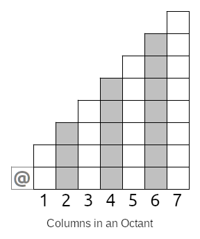
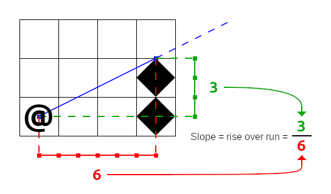
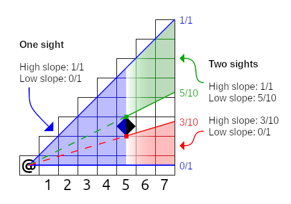

# Field of View

When you start a new game in RuggRogue, one of the first things you'll notice is that the player can only see their immediate surroundings.
As you move around the dungeon, you'll also find that the player's sight is additionally limited from seeing through walls.
In other words, the player's vision is confined to their *field of view*: the set of tiles that are visible from the player's position in a straight line.
Limiting vision to a field of view is one of the staples of the roguelike genre, and RuggRogue is no exception.

Despite its single topic focus, this chapter is going to cover a lot of ground.
The first thing this chapter will cover is how fields of view are used in RuggRogue.
Next comes the general approach to calculating fields of view and the design considerations that come with it, followed by a high-level description of the algorithm used to calculate fields of view.
The rest of the chapter will then describe the various parts of the RuggRogue source code that implement this algorithm.

## How Fields of View are used

Before diving into how fields of view are calculated, it's worth considering how they're used to begin with.
The most obvious purpose of field of view calculation is to define and limit how much of the map the player can see at any given time, in order to generate a sense of mystery and danger in exploring unknown territory.
However, it's also used for a number of other purposes.

Monsters in the dungeon are subject to the same vision rules as the player and thus also have a field of view calculated for them.
Monsters and the player both possess a `FieldOfView` component that tells the game to calculate the field of view when needed for the corresponding entity.
The `FieldOfView` component itself, defined in the `src/components.rs` file, consists of the position and range of the field of view, a bit grid with a bit set for each visible tile and a dirty flag to prevent unnecessary recalculations.
All of this calculation is regulated by the `recalculate_fields_of_view` function defined in the `src/vision.rs` file; it's here that we get our first glimpse of the use of the `ruggrogue::field_of_view` function that calculates the field of view itself.
Fields of view belonging to the player will update the memory of previously-seen map tiles stored in the `seen` bit grid field of the `Map` struct defined in the `src/map.rs` file.

The field of view of the player is used to limit which tiles can be targeted when using an item at range to stop them from using items directly through walls.
The tiles of the player's field of view are used as the basis for valid target tiles considered by the `TargetMode` struct in the `src/modes/target.rs` file.
This is done by filling in the `valid` field of the `TargetMode` struct in the `TargetMode::new` function.

The final use of field of view calculation is to shape the area of effect of items according to the target epicenter of their blast.
The `use_item` function in the `src/item.rs` file fills in a `targets` variable with entity IDs according to their positions within the field of view of the target epicenter; note the use of the `ruggrogue::field_of_view` function here to achieve this.

## Calculating Field of View

There are many ways that roguelikes choose to define their fields of view.
RuggRogue defines its field of view as all tiles that are visible from a starting tile in a straight line within some maximum range.
Roguelikes that use this definition generally approach field of view calculations in one of three ways:

1. *Ray casting*: Cast a straight line ray between the starting tile and every other tile; a tile is visible if the ray is not blocked.
2. *Shadow casting*: Trace visible tiles outwards from the starting tile, skipping shadows cast by blocking tiles described by slopes relative to the center of the starting tile.
3. *Permissive field of view*: A group of approaches that try to calculate visible tiles by detecting if a straight line can be drawn between any point in the starting tile and any point in each checked tile.

RuggRogue takes the **shadow casting** approach.
The ["Field of Vision" page on RogueBasin](http://roguebasin.com/index.php/Field_of_Vision) is a good starting point for finding out more about these approaches.
Ray casting runs pretty slowly, especially as fields of view grow larger, and performance matters somewhat considering RuggRogue calculates fields of view for monsters as well as the player.
On the other hand, there's not much written about permissive field of view calculation, and the different approaches tend to involve corner-case handling of common input scenarios, leading to messy algorithms.
Shadow casting is fast, precise and robust when it's implemented correctly.

There are two major design considerations when using shadow casting to calculate fields of view: **wall shape** and **determining visibility**.

The wall shape chosen by an implementation of the shadow casting algorithm determines the shape of the shadows that are cast by walls when they block vision.
The most obvious wall shape choice is square walls, where the wall is considered to completely fill its occupying tile.
This is a very common implementation choice, but surprisingly it leads to larger shadows and smaller, more claustrophobic fields of view compared to the results of other algorithms.
RuggRogue instead opts for *diamond-shaped walls*, in which a wall consists of a diamond drawn between the mid-points of its four sides.
This grants better visibility around corners and creates more natural-looking shadows behind occlusions.


Visibility determination is about exactly how a shadow casting implementation decides whether or not a tile is visible from the starting tile.
The obvious approach here is center-to-any visibility, i.e. a tile is visible if there is a straight line between the center of the starting tile to any point in the target tile.
Unfortunately, this leads to *asymmetry*: target tiles are visible from the starting tile, but not necessarily vice versa.
To preserve symmetry, we could instead opt for center-to-center visibility, i.e. a tile is visible if there is a straight line between its center and the center of the starting tile.
This also has a problem when applied naively: walls become *non-expansive*, i.e. standing next to a long straight wall renders faraway wall tiles as not visible, even while non-wall tiles next to them are visible.
RuggRogue adopts a hybrid strategy for visibility determination made up of two core rules:

1. Symmetric *center-to-center* visibility for non-wall tiles.
2. Asymmetric *center-to-mid-line* visibility for wall tiles.

We want to use "center-to-mid-line" visibility instead of "center-to-any" to make visibility determination match our diamond-shaped walls.
Center-to-mid-line visibility exploits the fact that diamond-shaped walls can also be considered as *plus-shaped* walls; it doesn't matter how the mid-points of each side of the tile are connected for the purposes of shadow casting.
We can therefore check if a wall is visible by seeing if any stem of the plus shape is visible from the central point of the starting tile.
In the following diagram, the far wall is asymmetrically visible due to one of its mid-lines, while every other tile is symmetrically visible, including the close wall:


It's important to remember that wall shape and visibility determination are implementation details and not core properties of the shadow casting algorithm itself.
The two are often confused in other literature when listing downsides to using shadow casting, or when comparing the results of shadow casting to that of other field of view algorithms.

## The Shadow Casting Algorithm

In order to make sense of the code in RuggRogue that calculates fields of view, we'll first need to understand how shadow casting works on an algorithmic level.
There are two broad approaches to implementing shadow casting: recursive and iterative.
The recursive approach solves the shadow casting problem by repeatedly breaking it down into smaller sub-problems, tracking visible areas as arguments fed into successive function calls.
The iterative approach loops over tiles while tracking visible areas explicitly in data structures.
RuggRogue implements iterative shadow casting since iterative algorithms tend to perform better than recursive ones in real-world cases, so that's what will be covered here.

Before getting into all of this, a couple of definitions are in order.
First, we'll use the word "wall" for tiles that block vision and "floor" for tiles that don't, just for convenience.
Second, we'll define y as increasing *upwards* like in most mathematics and geometry literature, so words like "higher" and "lower" make more sense.
In reality, grids and coordinates in RuggRogue treat y as increasing downwards, but shadow casting still works even when things are vertically flipped, so we can get away with it.

### Dividing Space to Make Shadow Casting Easier

The first step of shadow casting is to visit the *starting tile*, marked with an at-sign ("@") in all of these diagrams.
This seems obvious, but we won't be revisiting it at any other point in our algorithm, so it needs to be accounted for before anything else.

Beyond the starting tile, how are we going to handle all of the other tiles?
With shadow casting, we'll need to work with *slopes* going from the center of the starting tile to the corners of our diamond-shaped walls, but if we dive straight in with this information you'll run into a problem straight away.
Depending on whether our slopes are mostly horizontal or vertical, different wall corners are going to matter: mostly-horizontal slopes care about vertical wall corners, while mostly-vertical slopes care about horizontal wall corners.
Another problem is that slopes will occasionally straddle two tiles exactly, so we'll have to perform rounding to break ties, but if this rounding is applied uniformly we'll end up biasing vision in certain directions.
It seems like we'll need a lot of ugly special cases to avoid ugly and incorrect results... or will we?

Instead of working with the entire area all at once, we can divide the space around the starting tiles into eight slices or *octants*:


As it turns out, wall handling and rounding is handled the same way for all tiles in any single octant.
In octants where our slopes are mostly horizontal (octants 0, 3, 4 and 7 above) we only care about the vertical corners of our diamond-shaped walls; conversely, we only consider the horizontal corners in the other mostly-vertical octants (1, 2, 5 and 6 above).
When slopes straddle tiles, we want to round towards the nearest cardinal axis to avoid odd-looking bias, and this rounding is performed in the same direction for all tiles in an octant.
Dividing our processing into octants will make our logic a lot cleaner.

However, the best part about all of this is that we can now perform shadow casting in just one octant and use some clever mathematics to reuse our work in all of the other octants!
When we work in a single octant, we'll treat the starting tile as being at (0,0) coordinates and identify other tiles as offset from the starting tile by x and y values.
When we need real map coordinates instead, such as when checking if a tile is a wall or floor on the map, we can convert them using the following formulas:

```plaintext
real_x = x * real_x_from_x + y * real_x_from_y + start_x
real_y = x * real_y_from_x + y * real_y_from_y + start_y
```

In the above formulas, `real_x` and `real_y` are real map coordinates, `x` and `y` are tile coordinates in the octant relative to the starting tile, and `start_x` and `start_y` are the real map coordinates of the starting tile.
The other four coefficients are different for every octant, and have the following values:

Octant | `real_x_from_x` | `real_x_from_y` | `real_y_from_x` | `real_y_from_y`
------ | --------------- | --------------- | --------------- | ---------------
0 | 1 | 0 | 0 | 1
1 | 0 | 1 | 1 | 0
2 | 0 | -1 | 1 | 0
3 | -1 | 0 | 0 | 1
4 | -1 | 0 | 0 | -1
5 | 0 | -1 | -1 | 0
6 | 0 | 1 | -1 | 0
7 | 1 | 0 | 0 | -1

With these formulas and values we can write code to perform shadow casting in one octant, then run it with different sets of values from the above table to cover the other octants.

There's one final thing to note in the diagram from earlier.
Look at the highlighted tiles on the edges of the octants.
These tiles are shared by two octants, and we'll need to consider them in both octants in case they contain walls, but we also want to avoid visiting them twice.
It's easy enough to make this happen by only visiting these tiles in even-numbered octants, i.e. octants 0, 2, 4 and 6 above.

### Processing a Single Octant

To ensure that walls closer to the starting tile block vision, we'll need to process tiles near the starting tile and work our way outwards.
This means that our work will be broken down into columns, like so:



Whatever we do, we'll need to finish all of our work in one column before moving onto the next.
In the image above, we start with column 1 and process it completely, then column 2, then column 3 and so on.

### Determining Visible Tiles in a Column

Once we're down to the level of a single column, we need some way to describe the areas that are visible from the starting tile.
To understand the type of data that we need, we'll first need to understand two concepts: *slopes* and *sights*.

A **slope** describes the angle between the center of the starting tile and some other point, like the corner of a wall.
Here is an example of a slope of the top corner of a nearby wall:



The first thing to note about the slope above, and indeed all slopes, is that they are *always measured from the center of the starting tile*.
The center is the only point in the starting tile that stays in the same place regardless of flipping and transposing, which is what will happen when taking our work into other octants.

The next thing to note is that we're representing slopes as pairs of integers and measuring them out in *half-tile units*.
Slopes are fractional values and could be represented as floating point values instead, as some other shadow casting implementations will choose.
By measuring in half-tiles, RuggRogue avoids the performance overhead of converting between integers and floating point values.

Finally, even though a slope is created between two points, its influence extends beyond them.
This is what allows our field of view to properly expand outwards from the starting tile.

An important property of slopes is that they can be *compared*; slope comparison will be used later on to do things like test if a tile is symmetrically visible, for example.
Low slopes are considered to be of a value less than higher slopes.
One way to compare two slopes, `a` and `b`, is to define a less-than-or-equal-to inequality, like so:

```plaintext
a_rise / a_run <= b_rise / b_run
```

To avoid the need to divide and fall back on floating point values, we can multiply both sides of this inequality by the products of the runs:

```plaintext
a_rise / a_run * a_run * b_run <= b_rise / b_run * a_run * b_run
```

This simplifies to:

```plaintext
a_rise * b_run <= b_rise * a_run
```

If this inequality is true, then slope `a` is less than or equal to slope `b`.

We can use a pair of slopes as a way to represent a visible area; we'll call this a **sight**.
Here's an example of three sights in practice:



In the example above, the visible area in columns 1 through 5 can all be described by a single sight whose low slope is 0/1 and high slope is 1/1.
The wall tile in column 5 creates two sights: 0/1 to 3/10 and 5/10 to 1/1.
These two sights describe the visible area for columns 6 and 7.

Now that we know about sights and slopes, we can now define the (potentially) visible tiles in a column as the tiles inside the list of sights for that column.
We consider a tile as 'inside' a sight if any part of its mid-line is inside the sight.
Fortunately, we don't have to calculate any line intersections to determine this.
If we consider the starting tile as (0, 0) and our column numbers as x values, we just need to figure out the range of y values for a sight in that column.
Here's the basic line equation:

```plaintext
y = a * x + c
```

`y` is the value that we want, `x` is the column number, `a` is our slope and `c` is the constant offset.
Our `c` is zero since all of our slopes start at the center of the starting tile, while the `a` value is just `rise / run`, so our equation becomes this:

```plaintext
y = x * rise / run
```

There's a problem if we use this equation as-is: we're off by half a tile, since we defined our (0, 0) point as the *center* of the starting tile, not its bottom-left corner.
To correct for this, we'll need to add half a tile:

```plaintext
y = x * rise / run + 0.5
```

We can avoid resorting to floating point values by multiplying by two, adding one and exploiting the fact that integer division rounds down to achieve the same thing with only integer arithmetic:

```plaintext
y = (2 * x * rise / run + 1) / 2
```

If we plug in the values for the low and high slopes of a sight we'll get the exact y values of the tiles whose mid-lines lie inside that sight.
Here's an example of this formula in action:


In this diagram, we have a single sight with a low slope of 1/4 and high slope of 3/4, and we want to know which y values this sight covers in column 5.
If we apply the formula to the low slope, we get a low y of 1; doing to the same with the high slope gets us a high y of 4.
Therefore, the potentially visible tiles of this (1/4)-(3/4) sight in column 5 lie between y = 1 and y = 4 inclusive, highlighted above.

This is an example of a single sight projected onto a column, but if there are multiple active sights in a column we need to repeat this process for all of those sights in order to get all of the potentially visible tiles of that column.

### Processing Visible Tiles in a Column

So far, a column takes a list of sights as input that we'll call the *current sight list*.
For each sight in the current sight list, we can calculate the low and high y values of the potentially visible tiles of that sight in the column.
As we step through each potentially visible tile of a sight, we have two jobs:

1. Build up a *next sight list* based on the walls and floors detected in the current column.
2. Visit each tile to mark it as visible.

The word "visit" here differs between shadow casting implementations; some hard-code the marking of a visibility map here, others provide a callback to permit a caller to decide what to do.
RuggRogue's shadow casting implementation is built as an iterator, so it just returns the real map coordinates to whatever code is driving the iterator.
This is all that's needed for wall tiles, which are asymetrically center-to-mid-line visible.
All other tiles are only *symetrically* center-to-center visible, so we need to test if the tile is symmetrically visible and return it as a flag alongside the tile coordinates.
We can do this by testing if the slope of the tile's center point lies inside the low and high slopes of the current sight:

```plaintext
low_slope <= tile_center_slope <= high_slope
```

If this condition is true, the tile is symmetrically visible from the starting tile and should be marked visible.

Reading from the current sight list while building up a next sight list means we need *two* sight lists at any given time when working with a column.
The start of the shadow casting logic creates these lists and hands them to the octants.
Each octant initializes the lists: an empty *even list* and an *odd list* with a single sight covering the whole octant, i.e. a low slope of 0/1 and a high slope of 1/1.
Each odd column treats the odd list as its current sight list, then clears and starts pushing to the even list as the next sight list; even columns swap the roles of the even and odd lists.
This list-flipping strategy allows us to avoid the need to allocate extra lists during all of this.

To build up the next sight list, we'll need to scan for consecutive runs of floor tiles.
We need to step through each potentially visible tile in the sight while keeping track of a *working slope*.
The working slope is set to `None` to begin with or when stepping through a run of walls, and is set to `Some(slope)` when stepping through a run of floors, where `slope` is the slope where the current run of floors began.
Whenever the working slope changes from `Some(...)` to `None` we push a new sight onto the next sight list.

When we put all of this together, the logic for a single column looks something like this:

1. Pick current and next sight lists out of the even and odd lists based on whether this column is even- or odd-numbered.
2. Clear the next sight list.
3. For each sight in the current sight list:
    1. Calculate the low and high y values of potentially visible tiles to iterate over.
    2. Initialize `working_slope` to `None`.
    3. For each potentially visible tile in the sight:
        1. Calculate `low_mid_slope`: the slope of the center of the bottom edge of the tile.
        2. If the tile is a wall and `working_slope` is `Some(...)`:
            1. Push a new sight onto the next sight list:
                1. Set the low slope of the sight to `working_slope`.
                2. Set the high slope of the sight to `low_mid_slope`.
            2. Set `working_slope` to `None`.
        3. If the tile is a floor and `working_slope` is `None`:
            1. Set `working_slope` to the *higher* of `low_mid_slope` and the low slope of the current sight.
        4. Visit the tile by returning its real map coordinates and test its center for symmetric visibility.
    4. If `working_slope` is `Some(...)` after all of the tiles, push a final sight onto the next sight list:
        1. Set the low slope of the sight to `working_slope`.
        2. Set the high slope of the sight to the high slope of the current sight.

This looks like a lot to take in, but really all it's doing is looking for runs of consecutive floor tiles and adding them as sights to the next sight list when they end, while visiting potentially visible tiles.
If you do this for all of the columns in an octant, then repeat it for all eight octants, you'll have the full shadow casting algorithm!

### Algorithm Wrap-Up

If you poke around online, you'll find that there are many different ways to implement shadow casting.
The algorithm described here has a number of nice properties:

- It uses iteration instead of recursion for performance.
- It avoids the use of floating point values for performance.
- It performs no allocations except for the two sight lists, again for performance.
- It is precise: slopes are exact and nothing is approximated.
- It combines asymmetric vision for nice-looking walls with symmetric vision for other tiles for fair gameplay.
- It uses diamond-shaped walls for better visibility around corners.

## Implementing Shadow Casting in RuggRogue

Armed with an understanding of the shadow casting algorithm that RuggRogue uses to calculate fields of view, we can finally start looking at the code itself.

### Initializing and Using the Iterator

The most important part of the field of view story starts in the `recalculate_fields_of_view` function in the `src/vision.rs` file, and the most important part of that is reproduced below:

```rust,ignore
// Update field of view.
for (x, y, symmetric) in
    ruggrogue::field_of_view(&*map, coord.0.into(), fov.range, FovShape::CirclePlus)
{
    if symmetric || matches!(map.get_tile(x, y), &Tile::Wall) {
        fov.set((x, y), true);
    }
}
```

The `ruggrogue::field_of_view` function returns the iterator that implements shadow casting.
That iterator is initialized with the map and center starting tile, but you'll also notice the "range" and "shape" being given as well.
Vision is calculated up to a maximum range given in tiles.
The "shape" of a field of view determines how that range is treated: `FovShape::CirclePlus` effectively asks for a circle with a radius of that range plus half a tile.
Adding half a tile prevents single tiles poking out on the four cardinal directions that would occur with an exact radius circle of vision.

The iterator returns the map coordinates of visible tiles, along with a symmetric flag if the tile is considered symmetrically visible, i.e. its center point is visible to the center of the starting tile.
The body of the loop then makes the final decision about whether that tile is visible: a symmetrically visible tile is always visible, and walls are visible regardless of symmetry.

The `ruggrogue::field_of_view` function itself lives at the bottom of the `src/lib/field_of_view.rs` file.
It does nothing more than initialize an instance of the `FovIter` struct whose definition can be found near the top of the file.

The first interesting thing about the `FovIter` struct is the map that it takes.
The map it wants needs to adhere to two traits: the `BoundedMap` trait (defined in `src/lib/lib.rs`) that allows the upcoming logic to query the bounds of the map to avoid out-of-bounds access, and the `ViewableField` trait to check if a given coordinate blocks vision.

The other thing to note about the `FovIter` struct is that it holds a lot of book-keeping data aside from its initial parameters.
We can break down the fields into three groups:

1. Initial data
    - `map`: The map to calculate the field of view over.
    - `start_pos`: The map coordinates of the center starting tile to calculate the field of view from.
    - `range`: The maximum range of the field of view, in tiles.
    - `fov_shape`: The shape that the field of view should take: the game only uses `FovShape::CirclePlus` as described earlier.
2. Temporary data
    - `bounds`: Cached map bounds describing the inclusive range of valid coordinates of the map.
    - `max_dist2`: Maximum distance squared, derived from `range` and used as part of distance checking in order to shape the field of view.
    - `sights_even` and `sights_odd`: Even and odd sight lists described in the shadow casting algorithm section earlier.
    - `low_y` and `high_y`: Range of y values for the current sight being processed.
    - `low_sight_angle`: The working slope that holds the slope of the first floor tile as described in the shadow casting algorithm section earlier.
3. Iteration progress
    - `octant`: The current octant being processed; `None` means we're just getting started, while `Some(8)` means that the iterator is finished.
    - `x`: The column being processed within an octant: `None` means the octant was just entered.
    - `s`: The index into the current sight list within the column.
    - `y`: The y value of the tile being processed within the sight, ranging from `low_y` to `high_y` inclusive.

To fully appreciate why all of this data needs to be tracked in the `FovIter` struct and not, say, in variables in a function with nested loops, we need to dive into what happens after initialization.

### Driving the Iterator

Iterators are fundamentally inert: they'll never do any work or produce any values until something else drives them.
The driving of the `FovIter` iterator is done by the `for` loop that was shown earlier.
This repeatedly calls the `Iterator::next` function defined just above the code for the `ruggrogue::field_of_view` function.
You'll quickly notice that this function does very little on its own.
It exists only to call the `FovIter::advance` function defined above it repeatedly until it gets a valid `Some(...)` value or `self.octant` reaches 8, meaning that the iterator is finished.
This is due to the fact that the `FovIter::advance` function occasionally needs to perform logic without producing a valid tile output, so it needs to be called until it produces one.

### Advancing through the Shadow Casting Algorithm

The entire shadow casting algorithm implementation used by RuggRogue is housed in the `FovIter::advance` function that makes up the largest part of the `src/lib/field_of_view.rs` file.
There's a lot going in here, but if you've read through the shadow casting algorithm section earlier in the chapter you'll be equipped to understand it.

By far the most unusual thing about this function is that despite the multiple octants, columns, sights and tiles that need to be handled, there is not a single loop in the whole function.
This comes back to the fact that this is all one big iterator: it gets called once, does some work and produces an output, gets called again and does some more work.
This is why the `FovIter` struct housed so much temporary and iteration progress data: to remember where to pick up from after returning a single tile's worth of data.

The `FovIter::advance` function begins by declaring and initializing two variables: `out_pos` and `out_symmetric`, for the tile position and symmetry test to output respectively.
Setting these variables signals that the function should return their values after this iteration.
Leaving them be instead causes nothing to be returned, in turn causing the function to be called again immediately if the iteration hasn't finished yet.

The very first call to `FovIter::advance` sets the `octant` field to `Some(value)` where the value is the octant index of -1 to visit the starting tile, 0 through 7 for each of the octants, or 8 when shadow casting is complete.
The first level of `if` branches performs the logic for each of these cases.

Visiting the starting tile when `octant` is -1 provides the simplest example of how `FovIter` produces output while setting up for its next iteration.
Setting `out_pos` and `out_symmetric` causes these values to be returned by that iteration, while setting `octant` to `Some(octant + 1)` sets up the next iteration to resume processing in the very first octant.

When processing an octant the very first step is to prepare the even and odd lists.
This case is detected when the `x` (column) field is set to `None`: the odd list is cleared and set to a single sight covering the whole octant, i.e. low slope of 0/1 and high slope of 1/1.
The `x` field is then set to `Some(1)` where 1 is the index of the first column in the octant, which prevents this logic from running again until we need it.

The logic for processing a single column is gated with a check on `if x <= self.range`.
One of the first things done in this branch is this:

```rust,ignore
// Flip between using even and odd sights for current and next.
let (current, next) = if x % 2 == 0 {
    (&mut self.sights_even, &mut self.sights_odd)
} else {
    (&mut self.sights_odd, &mut self.sights_even)
};
```

If `x` is even, the current sight list is set to `sights_odd` and the role of the next sight list is given to `sights_even`; the lists are swapped when `x` is odd.

This gets us to the point where we need to loop over sights in the current sight list.
The index into this sight list is the `s` field which was previously initialized to `None`.
If `s` is `None` at this point we need to prepare the next sight list to be filled in by clearing it and setting `s` to `Some(0)` where 0 is represents the first entry in the current sight list.

If `s` is a valid index into the current sight list (i.e. `s < current.len()`), then we need to process the sight.
This starts by checking if `y` is `None`: in that case the `low_y` and `high_y` for the sight need to be calculated, `low_sight_angle` (i.e. the working slope) needs to be initialized to `None` and `y` needs to be be initialized to `Some(low_y)` to kick off iteration of potentially visible tiles in the sight.

There's a quick range and shape test to see if the tile being tested lies within the desired range; assuming it does, there's a bunch of things that need to be set up to deal with individual tiles:

- `real_x` and `real_y` are calculated with the help of the octant coefficients, depending on which octant is being processed.
- `low_mid_angle` is assembled, representing the slope of the mid-point of the bottom edge of the tile.
- An `in_bounds` callback is defined to avoid indexing coordinates outside of the map bounds.
- An `angle_lt_or_eq` callback is defined to compare slopes.

The next conditional block that checks `self.map.is_opaque(...)` is responsible for detecting runs of floor tiles and adding them as sights to the next sight list when those runs end.
If the tile is a wall and `low_sight_angle` is `Some(...)` value, a sight is added to the next sight list and `low_sight_angle` is reset to `None`.
On the other hand, if the tile isn't a wall and `low_sight_angle` is `None`, `low_sight_angle` is set to either `low_mid_angle` or the low slope of the sight, whichever is higher; we need this check to ensure that we're never expanding sights in a way that doesn't make sense.

With sight management out of the way we can finally visit the tile.
As mentioned earlier, this involves setting the `out_pos` and `out_symmetric` variables, but there's a catch to this.
First, we need to ensure that the tile is within the map bounds; we don't want to return out-of-bounds coordinates.
Second, remember those shared edges between octants?
This is the point where we check for that.
We don't have to worry if `y` is strictly between 0 and `x`, but those exact values are the shared edge tiles.
We only want to visit those if we're in octants that set the `include_edges` flag, which you may have noticed was part of the octant data amongst the hard-coded coefficients.
This `include_edges` flag is set for octants 0, 3, 4 and 7, so the shared edge tiles will be visited in these octants and skipped in the others.
Tile visitation is concluded by incrementing `y`.

When `y` ticks past the `high_y` set for the current sight, it needs to wrap up with a final sight if `low_sight_angle` is still set to `Some(...)` value at this point.
Other than that, `s` is incremented to move onto the next sight in the current sight list, and `y` is reset to `None` to invoke the start-of-sight logic the next time it's called.

Beneath that is the case where `s` has iterated through all of the sights in the current sight list, meaning that the whole column has been processed.
The `x` value is incremented to move onto the next column, while `s` is reset to `None`.

The final `else` block under that is when every column of the octant has been processed.
The iterator moves onto the next octant by incrementing the `octant` field and resetting `x` to `None`.
When the `octant` field takes on the `Some(8)` value, shadow casting is complete and the field of view has been fully calculated!

## Conclusion

The field of view code is some of the earliest code I ever wrote for RuggRogue.
Indeed, RuggRogue started as a fake terminal demo, and spent a lot of its early life as a proof-of-concept for shadow casting.
There's no doubt in my mind that I would write this differently if I were to revisit this today: make better use of Rust's iterator API, define slopes as a proper type instead of an integer tuple so I could define ordering and use normal inequality operators, and so on.
However, if I stayed and continually refined this field of view code, I would never have moved onto finishing the rest of the game.

Despite its issues, I'm still quite happy with how field of view calculation turned out: it runs well, the results are good and I can be confident that I understand shadow casting well enough to implement it from scratch.
